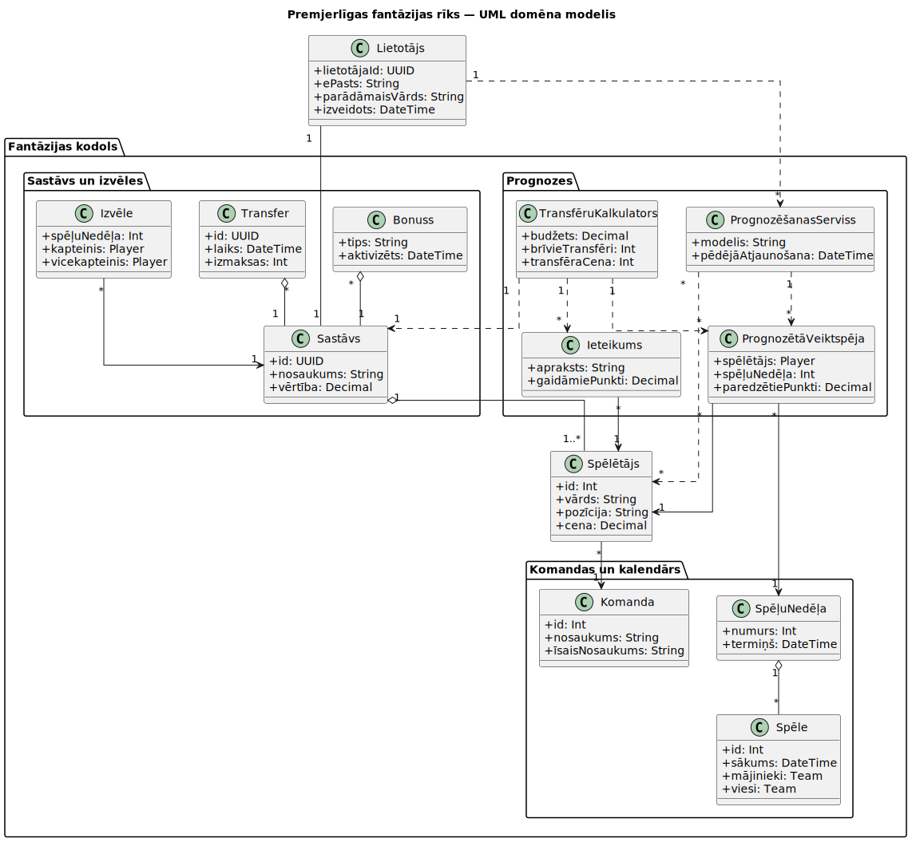

# Projektēšanas pārskats - FPL Asistents

## Ievads

### Problēmas nostādne
Fantasy Premier League (FPL) ir populāra fantāzijas futbola spēle, kurā lietotāji veido savu virtuālo komandu no reāliem Anglijas Premjerlīgas spēlētājiem un katru spēļu nedēļu iegūst punktus atbilstoši šo spēlētāju sniegumam laukumā. Lai sasniegtu labus rezultātus, lietotājiem regulāri jāpieņem stratēģiski lēmumi par sastāva izmaiņām, kapteiņu izvēli un spēlētāju transfēriem, balstoties uz plašu un dinamisku datu kopumu.

Šo lēmumu pieņemšana praksē ir sarežģīta, jo nepieciešams analizēt lielu apjomu statistikas - spēlētāju individuālo sniegumu, komandu formu, spēļu grafiku, traumas un citus kontekstuālus faktorus. Manuāla datu analīze ir laikietilpīga un prasa gan padziļinātas futbola zināšanas, gan spēju interpretēt statistiskos rādītājus. Lai gan pastāv vairāki tiešsaistes rīki, kas piedāvā prognozes un ieteikumus, lielākā daļa no tiem ir maksas risinājumi ar slēgtiem algoritmiem, kuru darbības principi nav publiski pieejami. Tas apgrūtina lietotāja izpratni par prognožu pamatotību un samazina šo rīku izglītojošo vērtību.

Tādējādi pastāv nepieciešamība pēc pieejama, caurspīdīga un uz datiem balstīta risinājuma, kas palīdzētu FPL spēlētājiem pieņemt pamatotākus lēmumus, vienlaikus nodrošinot saprotamu informācijas attēlojumu un analītisku pamatojumu.

### Darba un novērtēšanas mērķis
Darba mērķis ir izstrādāt tīmekļa lietotni `“FPL Asistents”`, kas sniedz lietotājam iespēju centralizēti apskatīt savu Fantasy Premier League sastāvu, ievadot savu FPL komandas identifikatoru (team ID), kā arī piekļūt detalizētai informācijai par spēlētājiem, komandām un spēļu nedēļām (gameweeks), izmantojot oficiālos FPL datus.

Projekta galvenais uzdevums ir izstrādāt un integrēt mašīnmācīšanās modeļus, kas prognozē spēlētāju sagaidāmo fantasy punktu skaitu, balstoties uz statistikiem rādītājiem. Iegūtās prognozes tiek izmantotas, lai lietotājam piedāvātu personalizētus ieteikumus par potenciāli izdevīgiem spēlētāju transfēriem, ņemot vērā budžeta ierobežojumus, sastāva struktūru un konkrētās spēļu nedēļas kontekstu.

Darba novērtēšanas mērķis ir analizēt izstrādātā risinājuma funkcionalitāti, prognožu precizitāti un lietojamību. Tas tiek veikts, salīdzinot prognozētos spēlētāju punktus ar faktiski iegūtajiem FPL rezultātiem, kā arī izvērtējot, vai piedāvātie transfēru ieteikumi spēj uzlabot lietotāja lēmumu kvalitāti.


## Līdzīgu risinājumu apskats

### Risinājumi
- [Basketbola turnīra simulātors](https://marchmathness.davidson.edu/index.html) - Nacionālā koledžu sporta asociācijas basketbolu turnīra "March Madness" labāko komandu prognozēšanas simulācija. 

- [NCAA basketbola turnīra rezultātu statistiska prognozēšana](https://catsstats.timchartier.com/mens-basketball/ncaa-tournament-first-round-preview/) - Aplūkota basketbola sākuma pozīcijas atrašanās vietas ietekme ar citām spēlētāju/komandas metrikām, kas varētu ietekmēt spēles rezultātu. Šāda statistiska analīze tiek pielietota, lai iegūta attiecīgās komandas aprēķināto varbūtību uzvarēt noteiktu spēli. 

- ['Fantasy' līgas modelis](https://fplform.com/fpl-predicted-points) - Anglijas augstākās divīzijas futbolā fantāziju līgas modelis, kur piedāvā izvēlēties starp daudziem spēlētājiem, lai, kombinējot tos savā starpā, iegūtu pēc iespējas labāku rezultātu. Piedāvātais modelis ļauj ņemt vērā dažādus spēlētāja atribūtus, kur nepieciešams atrast sastāvu, kas dos labāko rezultātu, ņemot vērā spēlētāju sniegumu laukumā.

- [Vispārēja analīze par profesionāla futbola mačiem](https://figshare.com/articles/software/Plots_replication_code_of_Nature_Scientific_Data_paper/11473365?backTo=%2Fcollections%2FSoccer_match_event_dataset%2F4415000&file=20479890) - Pētījums, kas integrē datu apstrādi, statistiku, vizualizācijas un tīklveida modelēšanu, lai identificētu un interpretētu futbolam raksturīgos spēles modeļus, balstoties uz 1941 maču datu kopu.

- [FPL review](https://fplreview.com) -
Mājaslapa apkopo spēlētāju statistiku un prognozē sagaidāmo punktu skaitu spēlētājiem nakāmājās spēlēs. Piedāvā spēlēs stratēģijas, kas ļaus maksimizēt prognozējamo punktu skiatu gan noteiktajā nedeļā, gan viss sezona garumā.

- [Solio analytics](https://solioanalytics.com) -
Līdzīgi, ka FPL review, apkopo spēlētāju statistiku un prognozē sagaidāmo punktu skaitu spēlētājiem nakāmājās spēlēs. Izmantoto metožu starpības dēļ, prognozētie punkti nedudz atšķiras. Atšķirībā no FPL review, piedāvā arī statistskus parametrus, dažādu rezultātu un sagaidāmo punktu sadalījumu.

 - [LeansAI](https://leans.ai/) -
LensAI izveidotai modelis “REMI” apkopo datus gan no vēsturiskajiem, gan aktuālajiem avotiem, tostarp komandu un spēlētāju statistiku, formu, traumas, spēļu kontekstu un tirgus koeficientus. Tas veic statistiskus aprēķinus un apmācību, dinamiski atjaunojot prognozes. Modelis spēj prognozēt vairākus sporta veidus un līgas, piemēram, NBA, CBB, NFL, kā arī citas populāras līgas, ģenerējot izvēles ar norādītu uzvaras procentu diapazonu (53–58%). Konkrētas modeļu arhitektūras netiek atklātas, taču REMI izmanto rekursīvo mašīnmācīšanos, lai uzlabotu precizitāti, mācoties no iepriekšējām kļūdām, nodrošinot 2–6 dienu prognozes.

- [Rithmm](https://www.rithmm.com/) -
Rithmm analizē miljardiem datu punktu (komandu un spēlētāju statistika, forma), lai simulētu NBA vai citas sporta/līgas spēles un ģenerētu prognozes. Lietotāji var veidot bezkoda personalizētus modeļus, pielāgojot faktorus, un saņemt augstas pārliecības “Bolt picks”. Platforma piedāvā pielāgojamus modeļus un koeficientu salīdzinājumu, atšķirībā no citām platformām uzlabojot derību lēmumus ar AI vadītu analīzi.
 
### Risinājumu salīdzinājumi

| Risinājums  | Kā strādā (algoritms/pieeja) | Priekšrocības | Ierobežojumi |
|-------------|------------------------------|---------------|--------------|
| Basketbola turnīra simulātors|Lieto lineāras sistēmas|Plaša izvēle starp sistēmas koeficentiem(weights).|Pārāk elementārs algoritms. Specifisks tikai "March Madness" turnīram basketbola komandām.|
| NCAA basketbola turnīra statistiskā prognozēšana| Izmanto dažus galvenos statistiskos rādītājus, lai prognozētu spēles rezultātu. | Nelielo parametra skaita dēļ viegli saprotams, rezultātus ērti saprast. |Izmanto nelielu skaitu parametru, lai prognozētu uzvarētāju. Rezultāti neņem vērā pēkšņas izmaiņas spēles gaitā. |
| 'Fantasy' līgas modelis | Tiek izvēlēti spēlētāji noteiktās laukuma pozīcijās. Nepieciešams izveidot komandu, iekļaujoties noteiktajās robežās un tiek piešķirti punkti ņemot vērā iegūto rezultātu. | Plaša spēlētāju un to raksturojošo datu izvēle. Paredzēto un faktisko spēlētāju rezultātu ir vienkārši salīdzināt. | Nepieciešami liela apjoma dati. Neparedzētas izmaiņas spēlē var krasi ietekmēt rezultātu. |
| Vispārēja analīze par profesionāla futbola mačiem|Tabulāro datu apstrāde, statistiski kopsavilkumi, telpiskā vizualizācija un tīklā balstīta modelēšana|Balstās uz plašu datu kopu. Viegli modificējams kods.|Nav tieši vērsta uz prognozēšanu. Grūti pielietojama praktiskām vajadzībām (fantasy). Dati, kas nepieciešami algoritmiem kopš 2018. gada, nav publiski pieejami.|
| FPL review                                             |Punktu progonozes algoritms nav publicēts|Ērts, saprotmas, viegli lietojams interfeiss, ideāli piemēros Fantasy spēlētājiem, ļauj ātri atrast lābākās maiņās sastāvā|Algoritms nav publicēts, prognozes kvalitāti grūti novērtēt|
| Solio analytics                                        |Punktu progonozes algoritms nav publicēts|Ērts, saprotmas, viegli lietojams interfeiss, daudz interesantu staistisko paramētru|Algoritms nav publicēts, prognozes kvalitāti grūti novērtēt|
| LeansAI    | Modelis “REMI” apkopo miljoniem datu punktu no vēsturiskajiem un aktuālajiem avotiem, veic statistiskus aprēķinus un apmācību, un dinamiski atjaunojas, lai ģenerētu izvēles ar norādītu uzvaras procentu diapazonu. (Konkrētas modeļu arhitektūras netiek atklātas.) | Fokuss uz vērtību, reāllaika atjauninājumi un dinamiska mācīšanās., piemērots pieredzējušiem lietotājiem. | Ierobežots prognožu skaits dienā (2–6), mainīgs sniegums atkarībā no datiem, premium funkcijas pieejamas tikai maksas lietotājiem. | 
| Rithmm     | AI modeļi ir apmācīti uz vairāku gadu NBA (cita sporta/līgas) datiem un simulē spēles tūkstošiem reižu. Tiek ņemta vērā spēlētāju statistika, komandas forma, spēles konteksts, traumas un vēsturiskais sniegums. Lietotāji var veidot bezkoda personalizētus modeļus, izvēloties svarīgākos faktorus, lai algoritms aprēķinātu ticamākos iznākumus.| Personalizācija, ticamības līmeņi, atbalsta dažādus sporta veidus.       | Maksas funkcijas, algoritms nav pilnībā publisks, rezultāti atkarīgi no datu kvalitātes. |


### Secinājumi

Lielākoties visi apskatītie risinājumi balstās uz statistisko datu analīzi, vēsturiskiem rezultātiem un dažādiem algoritmiem, tostarp mašīnmācīšanos vai simulācijām, lai prognozētu spēļu iznākumus, spēlētāju punktus vai komandu sniegumu basketbolā un futbolā. Tie ņem vērā faktorus kā statistiku, formu, traumas un kontekstu, bet lielākoties nepublisko precīzu modeļu arhitektūru, kas apgrūtina to kvalitātes novērtēšanu. No bezmaksas viedokļa piedāvājumi ir ierobežoti, un pilnvērtīga funkcionalitāte prasa abonementu, kas padara tos piemērotus pieredzējušiem lietotājiem vai derību entuziastiem. Kopumā apskatītie risinājumi demonstrē AI potenciālu sporta prognozēšanā, taču lielākoties tie ir orientēti uz derībām vai fantasy līgām, nevis uz tīru analīzi un lietotāja pieejamību. Mūsu projektā plānojam piedāvāt bezmaksas piekļuvi prognozēm, vienkāršu un saprotamu interfeisu, lai lietotājs varētu ātri izprast komandu sniegumu un prognozes. Šādi mēs nodrošināsim projektu, kas ir gan izglītojošs, gan pieejams plašākai auditorijai, atšķiroties no esošajiem komerciālajiem risinājumiem.


## Tehniskais risinājums

### Prasības
- Lietotājs var ievadīt savu FPL komandas ID un apskatīt savu sastāvu.
- Sistēma nodrošina detalizētu informāciju par visiem spēlētājiem, to statistiku un komandu informāciju.
- Lietotājs var apskatīt konkrētās spēļu nedēļas (gameweek) informāciju.
- Prognozējam spēlētāju sagaidāmo fantasy punktu skaitu, izmantojot ML modeļus.
- Balstoties uz prognozēm, sistēma sniedz ieteikumus par potenciāli izdevīgiem transfēriem.

### Algoritms

Mūsu FPL Asistenta sistēma izmanto **divpakāpju algoritmu**, lai lietotājiem sniegtu **spēlētāju punktu prognozes** un **optimālas transfēru rekomendācijas**.

#### 1. Fantasy punktu prognozēšanas algoritms

Fantasy punktu prognozēšana balstās uz **mākslīgā neironu tīkla (ANN)** pieeju. Sistēmā tiek izmantoti četri atsevišķi modeļi, katrs paredzēts vienai spēlētāju pozīcijai: vārtsargi, aizsargi, pussargi un uzbrucēji. Šāda pieeja ļauj ņemt vērā katras pozīcijas statistisko specifiku un spēles lomas atšķirības.

**Darbības plūsma:**

1. Lietotājs ievada FPL Team ID.
2. Sistēma iegūst spēlētāju statistiku, komandas kontekstu un spēļu nedēļas informāciju no FPL API.
3. Pamatojoties uz spēlētāja pozīciju, tiek izvēlēts atbilstošais neironu tīkla modelis.
4. Modelis aprēķina paredzētos fantasy punktus konkrētajam spēlētājam.
5. Rezultāts tiek saglabāts transfēru analīzei un sastāva optimizācijai.

**Modeļu izvēles blokshēma:**


**Neironu tīklu arhitektūra:**

```python
self.net = nn.Sequential(
    nn.Linear(n_features, 128),
    nn.BatchNorm1d(128),
    nn.ReLU(),
    nn.Dropout(0.25),

    nn.Linear(128, 64),
    nn.BatchNorm1d(64),
    nn.ReLU(),
    nn.Dropout(0.2),

    nn.Linear(64, 1)
)
```

**Darbības princips:**

* Ievaddati: spēlētāja statistika, komandas konteksts, spēļu nedēļas informācija.
* Slēptie slāņi: lineāri slāņi, ReLU aktivācija, Dropout regulēšana.
* Normalizācija: BatchNorm slāņi.
* Prognoze: paredzētie fantasy punkti.

#### 2. Transferu ieteikumu algoritms

Balstoties uz prognozētajiem punktiem, sistēma ģenerē ieteikumus par spēlētāju nomaiņu sastāvā.

**Darbības plūsma:**

1. Esošā sastāva analīze: noteikt spēlētājus, budžetu, brīvos transfērus un chip efektus.
2. Kandidātu saraksts: pieejamie spēlētāji atbilstoši pozīcijai, cenai un komandu ierobežojumiem.
3. Transfēru atlase: izvēlēts labākais aizvietotājs, kas palielina sagaidāmos punktus.
4. Stratēģiju veidošana: Safe, Moderate un Risky stratēģijas.
5. Rezultātu sagatavošana lietotājam: ieteiktie transfēri, stratēģijas, top prognozētie spēlētāji ārpus sastāva, budžets, brīvie transfēri.

**Pseido kods transfēru loģikai:**

```text
function generate_transfers(team_id):
    squad = fetch_current_squad(team_id)
    budget, free_transfers = calculate_resources(squad)

    candidate_pool = filter_players(all_players, squad, budget, team_limit)

    recommended_transfers = []
    for player in squad:
        best_option = select_best_candidate(player, candidate_pool)
        if best_option:
            recommended_transfers.append(best_option)

    strategies = build_strategies(recommended_transfers, free_transfers)
    return recommended_transfers, strategies, budget, free_transfers
```

Šī loģiskā sadaļa parāda visu plūsmu no spēlētāja datu ievades, caur pozīcijai atbilstošiem ML modeļiem, līdz transfēru rekomendācijām, saglabājot gan tehnisko, gan lietotāja perspektīvu saprotamību.

### Konceptu modelis
Koncepta modeļa PlantUML fails pieejams: [konceptu_modelis/modelis.plantuml](konceptu_modelis/modelis.plantuml) 


#### Virsotņu pārskats

- Lietotājs: `lietotājaId`, `ePasts`, `parādāmaisVārds`, `izveidots` — konta identitāte un reģistrācijas dati.
- Spēlētājs: `id`, `vārds`, `pozīcija`, `cena` — futbola spēlētāja bāzes info un cena FPL kontekstā.
- Komanda: `id`, `nosaukums`, `īsaisNosaukums` — Premier League komandas identitāte un abreviatūra.
- SpēļuNedēļa: `numurs`, `termiņš` — spēļu nedēļas numurs un menedžēšanas termiņš.
- Spēle: `id`, `sākums`, `mājinieki`, `viesi` — konkrētas spēles grafiks un komandas.
- Sastāvs: `id`, `nosaukums`, `vērtība` — lietotāja FPL sastāva identitāte un vērtība.
- Izvēle: `spēļuNedēļa`, `kapteinis`, `vicekapteinis` — nedēļas izvēlētie kapteiņi.
- Transfer: `id`, `laiks`, `izmaksas` — transfer notikums un tā ietekme uz budžetu.
- Bonuss: `tips`, `aktivizēts` — bonusu aktivizācijas pamats.
- PrognozēšanasServiss: `modelis`, `pēdējāAtjaunošana` — prognožu dzinēja konfigurācija un atsvaidzinājums.
- PrognozētāVeiktspēja: `spēlētājs`, `spēļuNedēļa`, `paredzētiePunkti` — modelētie punkti konkrētam spēlētājam spēļu nedēļā.
- TransfēruKalkulators: `budžets`, `brīvieTransfēri`, `transfēraCena` — ieteikumu aprēķinam.
- Ieteikums: `apraksts`, `gaidāmiePunkti` — piedāvātā darbība un tās potenciāls.

#### Virsotņu attiecības
- Sastāvs `"1" o-- "1..*"` Spēlētājs
- Spēlētājs `"*" --> "1"` Komanda
- SpēļuNedēļa `"1" o-- "*"` Spēle
- Izvēle `"*" --> "1"` Sastāvs
- Transfer `"*" o-- "1"` Sastāvs
- Bonuss `"*" -- "1"` Sastāvs
- Lietotājs `"1" -- "1"` Sastāvs
- PrognozēšanasServiss `"1" ..> "*"` PrognozētāVeiktspēja
- PrognozētāVeiktspēja `"*" --> "1"` Spēlētājs
- PrognozētāVeiktspēja `"*" --> "1"` SpēļuNedēļa
- TransfēruKalkulators `"1" ..> "1"` Sastāvs
- TransfēruKalkulators `"1" ..> "*"` PrognozētāVeiktspēja
- TransfēruKalkulators `"1" ..> "*"` Ieteikums
- Ieteikums `"*" --> "1"` Spēlētājs
- Lietotājs `"1" ..> "*"` PrognozēšanasServiss

### Tehnoloģiju steks

* **Ārējo datu nodrošinātāja API** – [Fantasy Premier League API](https://fantasy.premierleague.com/api/bootstrap-static/)

* **Backend** – Python (Django)

* **Frontend** – HTML, CSS, JavaScript

* **Datu bāze** – PostgreSQL (izmantojot Django ORM modeļus)

* **Hostings / Izvietošana** – Render platforma (Ubuntu servera vide)

* **Datu atjaunināšana un automatizācija** – GitHub Actions (periodiski uzdevumi / cron)

* **ML modeļu apmācība** – Python (PyTorch bibliotēka), produkcijā pārveidots uz ONNX formātu

### Programmatūras apraksts
FPL Asistenta lietotne ir tīmekļa platforma, kas ļauj lietotājiem apskatīt savu Fantasy Premier League komandu un iegūt prognozes par spēlētāju punktiem. Lietotājs ievada savu komandas ID, un sistēma nodrošina šādas funkcionalitātes:

1. **Sastāva pārskats** – lietotājs redz savu komandu, spēlētāju pozīcijas, cenas un sagatavotās spēļu nedēļas sastāva punktus.

2. **Spēlētāju statistika** – detalizēta katra spēlētāja statistika, piemēram, goli, piespēles, laiks laukumā, traumas un formu rādītāji.

3. **Komandu informācija** – informācija par Premier League komandām, to abreviatūrām, spēlētājiem un komandas formu.

4. **Spēļu nedēļas (Gameweek) pārskats** – skatāms katras spēļu nedēļas grafiks, mājinieki un viesi.

5. **Prognozēšanas serviss** – četri atsevišķi neironu tīkla modeļi prognozē spēlētāju sagaidāmos fantasy punktus, katrs modelis pielāgots konkrētai spēlētāju pozīcijai (vārtsargi, aizsargi, pussargi, uzbrucēji). Modeļi izmanto vēsturisko statistiku un aktuālos datus no FPL API.

6. **Transfēru ieteikumi** – sistēma aprēķina un piedāvā optimālus spēlētāju transfērus, balstoties uz prognozētajiem punktiem un budžeta ierobežojumiem.


## Novērtējums
### Novērtēšanas plāns
**Eksperimenta mērķis:**

* Novērtēt ML modeļa prognožu precizitāti spēlētāju fantasy punktu prognozēšanā.

**Ieejas dati:**

* Aktuālie FPL spēlētāju statistikas dati no FPL API.

**Novērtēšanas mēri:**

* MAE (Mean Absolute Error) – vidējā absolūtā kļūda starp prognozētajiem un faktiskajiem punktiem.

**Eksperimentu plāns:**

1. Savākt aktuālos FPL datus un izvēlēties testēšanas spēļu nedēļas.
2. Veikt prognozes visiem spēlētājiem, izmantojot ML modeļus katrai pozīcijai.
3. Salīdzināt prognozētos punktus ar faktiskajiem FPL datiem.
4. Aprēķināt MAE katrai pozīcijai un vidēji visam spēlētāju kopumam.
5. Analizēt rezultātus un identificēt modeļu stiprās un vājās puses.

### Novērtēšanas rezultāti
Pamatojoties uz izstrādāto novērtēšanas plānu, tika veikts prognožu precizitātes novērtējums, izmantojot reālus Fantasy Premier League spēļu nedēļas datus. Tabulā sniegts prognozēto un faktisko fantasy punktu salīdzinājums astoņiem spēlētājiem, katrai spēlētāju pozīcijai izvēloties divus pārstāvjus.

| Spēlētājs | Pozīcija        | Prognozētie punkti | Reālie punkti | MAE  |
| --------- | --------------- | ------------------ | ------------- | ---- |
| Haaland   | Uzbrucējs  | 8.01               | 7             | 1.01 |
| Thiago    | Uzbrucējs  | 5.97               | 12            | 6.03 |
| Rogers    | Pussargs   | 4.43               | 3             | 1.43 |
| Foden     | Pussargs   | 4.72               | 2             | 2.72 |
| Guehi     | Aizsargs  | 4.14               | 6             | 1.86 |
| Mukiele   | Aizsargs  | 4.60               | 3             | 1.60 |
| Sanchez   | Vārtsargs   | 2.38               | 2             | 0.38 |
| Dubravka  | Vārtsargs  | 1.54               | 3             | 1.56 |

Balstoties uz veikto prognožu novērtēšanu, tika aprēķināta vidējā absolūtā kļūda (MAE), kas raksturo modeļa prognožu precizitāti.

**Vidējais MAE** visam spēlētāju kopumam ir **2.07 punkti**, kas norāda, ka modelis vidēji kļūdās par aptuveni diviem fantasy punktiem uz vienu spēlētāju. Fantasy Premier League kontekstā šāds rezultāts ir uzskatāms par pietiekami labu un praktiski izmantojamu.

**Analizējot kļūdu pa spēlētāju pozīcijām**, tika iegūti šādi rezultāti:

* **Vārtsargi (MAE = 0.97):** visprecīzākās prognozes, jo modelis spēja prognozēt to, ka abi vārtsargi nespēs nosargāt vārtus visas sspēles garumā. 
* **Aizsargi (MAE = 1.73):** modelis spēja prognozēt veiksmīgo aizsarga spēli.
* **Pussargi (MAE = 2.08):** abi pussargi nospēlēja slikti, tāpēc modeļa vērtējums bija parāk augsts.
* **Uzbrucēji (MAE = 3.52):** modelis nespēja prognozēt 2 vārtus, ieistus Thiago. 

Kopumā rezultāti apstiprina, ka **pozīcijai specifisku neironu tīklu izmantošana ir pamatota un efektīva**, tomēr uzbrucēju modeļiem nākotnē nepieciešama papildu optimizācija, piemēram, ieviešot papildu ieejas pazīmes vai paplašinot apmācības datu kopu.


## Secinājumi
Neironu tīkls, kas izveidots šī projekta ietvaros, salīdzinoši labi prognozē katra spēlētāja paredzamo punktu skaitu. Taču, neskatoties uz salīdzinoši precīzajām prognozēm, modeli ir iespējams ievērojami uzlabot, ņemot vērā parametrus, kuri nav brīvi pieejami.
Ievērojama šī risinājuma priekšrocība ir lietotāja ērtība – salīdzinājumā ar citiem modeļiem, kas vairāk fokusējas uz statistikas datu padziļinātu izpēti, mūsu projekts piedāvā ērtāku lietošanas pieredzi iesācējiem. Tas ļauj ātri, vienkārši un saprotami iegūt ne tikai prognozes, bet arī transferu stratēģijas.